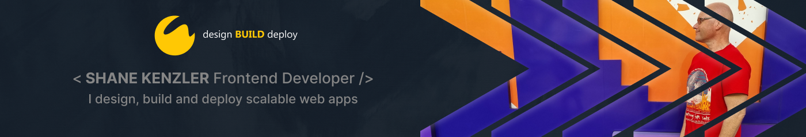

___

#### Background

My passion is building and deploying web apps developed using React combined with a solid grounding in HTML5, CSS3 and JavaScript. In addition, I have derived strong programming principles from attaining a Bachelor Degree in Computer Science, enabling me to apply these skills toward the completion of personal projects.

I have been working in the Print Industry for over fifteen years. Problem solving is a key component of my current role as Production Supervisor. I am constantly finding ways to automate processes, streamline workflows and empower each team member. I have built a strong, highly efficient team by encouraging innovation, promoting an agile workforce and supporting open communication.

Self development and growth are important to me. I am active in increasing my knowledge base and pushing into new and exciting opportunities.

___

