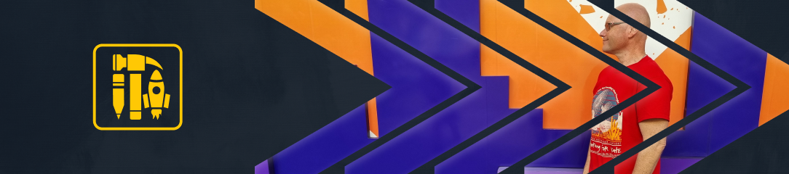

___

#### Background

Embracing tech, this is where I'm at. So many frameworks and libraries to build from, not to mention some really incredible AI technologies to build smarter. My new design process begins using relume to create sitemaps and generate wireframes. These sitemaps and wireframes can be imported straight into Figma. After creating a mood board, design decisions can be made about fonts, colours, icons, images, components and animations. I'm currently exploring Framer as a development tool but have also started to incorporate Codeium into my build process in VS Code. So many possibilities. It's an exciting time for designers and developers to push the possibilites of creativity. 

___

